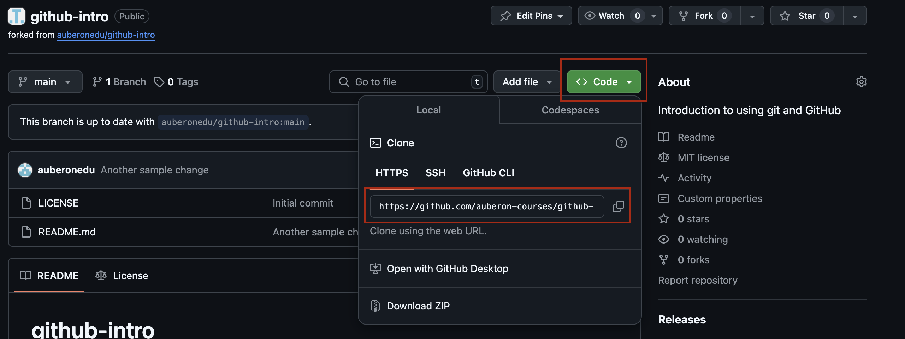

# github-intro
Introduction to using git and GitHub. Will lead you through your first fork, clone, commit, and push.


## Fork the Repository
1. Make sure you are logged into your GitHub account.
1. Fork this repository (repo) by clicking the *fork* button.
 
    > A fork is a *GitHub* concept, not a git concept. It's creating a copy of the repo in your online GitHub account, but it doesn't download the code to your computer.
1. Keep this browser window open,  we will return to it in a moment.


## Navigate your command line
1. Open your command line (Git Bash on Windows, Terminal on Mac).
1. Create a new directory where you will store repositories for this course. By default this will be in your home directory, but you can choose to put it elsewhere if you like. Run the below command to make a directory named `sdev301`.
    ```
    mkdir sdev301
    ```
1. Move into this new directory using the `cd` command:
    ```
    cd sdev 301
    ```
1. Keep your terminal window open, we will return to it in a moment.

## Clone the Repository
1. Go back to the browser window. Ensure that you are looking at your fork of the repository. You should see `YOUR-USERNAME / github-intro` near the top of the screen, where `YOUR-USERNAME` is your GitHub username. This is really important!
1. Click on the green *Code* button. Then, click on the squares to the right of the URL that pops up to copy it to your clipboard.
    
1. Return to your terminal window. Run the below command, replacing `YOUR-CLONE-URL` with the URL you copied from the green *Code* button on GitHub.
    ```
    git clone YOUR-CLONE-URL
    ```
    > Hint: In Windows Git Bash, paste by right-clicking. In Mac Terminal, paste by pressing cmd-V.
1. Verify that the repository was correctly copied by running `ls`. You should see `github-intro` as a directory. 
    >*Cloning* makes a copy from GitHub onto your computer.
1. Change to the repo directory by running:
    ```
    cd github-intro
    ```

# Make a change
1. Open VS Code in the current directory by running:
    ```
    code .
    ```
    If this does not work, you can instead open VS Code, and click on File > Open Folder. Then find and select the `github-intro` folder. Either way, keep the terminal window open. We will return it it soon.
1. Open the `README.md` file. Make any change to it (adding your name, writing a poem, fixing a typo you found, etc).
1. Save the changes.

# Add and commit changes
1. Return to the terminal. It should still be in the `github-intro` directory.
1. Run the below command to check the status of your changes.
    ```
    git status
    ````
    You should expect to see `README.md` in red text.
1. Run the below command to stage your change for a commit:
    ```
    git add README.md
    ```
    > This tells git that you want your changes to the `README.md` file to be included in your next commit.
1. Check the status again:
    ```
    git status
    ```
    `README.md` should now be in green text.
1. Commit the change with some meaningful description:
    ```
    git commit -m "SOME MEANINGFUL DESCRIPTION"
    ```
    > Make sure your description is in quotation marks. It should be a short phrase like "Added haiku to README." For now, do not use special characters like an exclamation mark. This can confuse your terminal.

    > Making a commit is like making a checkpoint. You'll always be able to come back to the way your code is now.
